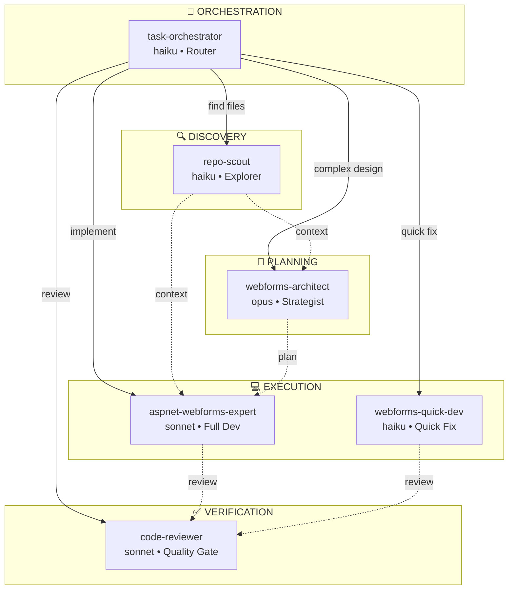

# ASP.NET Web Forms Plugin - Overview

## 📦 Plugin Structure

```
aspnet-webforms-plugin/
├── .claude-plugin/
│   └── plugin.json              # Plugin metadata
├── agents/
│   ├── task-orchestrator.md     # 🎯 Request router (haiku)
│   ├── repo-scout.md            # 🔍 File explorer (haiku)
│   ├── webforms-architect.md    # 🧠 System designer (opus)
│   ├── webforms-quick-dev.md    # ⚡ Quick fixes (haiku)
│   ├── aspnet-webforms-expert.md # 💻 Full implementation (sonnet)
│   └── code-reviewer.md         # ✅ Quality gate (sonnet)
├── skills/
│   ├── aspnet-webforms-senior/
│   │   └── SKILL.md             # WebForms expertise
│   ├── ultra-think/
│   │   └── SKILL.md             # Deep analysis framework
│   └── search-patterns/
│       └── SKILL.md             # Search pattern library
├── .mcp.json                    # MCP server config
├── .gitignore
├── README.md                    # Main documentation
├── SETUP.md                     # Installation guide
├── CHANGELOG.md                 # Version history
└── OVERVIEW.md                  # This file
```

## 🤖 Agent Hierarchy



## 🎯 Agent Selection Guide

| Request Type | Agent | Model | Speed |
|--------------|-------|-------|-------|
| Find files, audit codebase | `repo-scout` | haiku | ⚡⚡⚡ |
| Simple fix (< 50 lines) | `webforms-quick-dev` | haiku | ⚡⚡⚡ |
| Full implementation | `aspnet-webforms-expert` | sonnet | ⚡⚡ |
| Architecture, migration | `webforms-architect` | opus | ⚡ |
| Code review, security audit | `code-reviewer` | sonnet | ⚡⚡ |
| Unknown/complex request | `task-orchestrator` | haiku | ⚡⚡⚡ |

### Decision Tree

```
User Request
    │
    ├─ "Find/Search/List files" ──────────► repo-scout
    │
    ├─ "Add button/Fix typo/Simple" ──────► webforms-quick-dev
    │
    ├─ "Deep Analysis/Migration/Design" ──► webforms-architect
    │
    ├─ "Review/Audit/Check security" ─────► code-reviewer
    │
    ├─ "Create page/Implement feature" ───► aspnet-webforms-expert
    │
    └─ Unclear/Complex ───────────────────► task-orchestrator
```

## ✅ Đã hoàn thành

- ✅ Plugin structure chuẩn Claude Code
- ✅ 6 agents với vai trò chuyên biệt
- ✅ 3 skills với nội dung chi tiết
- ✅ Agent hierarchy và routing logic
- ✅ MCP server configuration
- ✅ Documentation đầy đủ
- ✅ Setup guides cho Windows/Linux/Mac

## 🚀 Quick Start

### 1. Test local

```bash
# Windows
xcopy /E /I aspnet-webforms-plugin %USERPROFILE%\.claude\plugins\aspnet-webforms-plugin

# Linux/Mac
cp -r aspnet-webforms-plugin ~/.claude/plugins/

# Test
claude
/plugin list
```

### 2. Usage Examples

#### Example 1: File Discovery
```
User: "Find all files using Oracle connections"

Agent: repo-scout (haiku)
→ Fast search, returns file list
```

#### Example 2: Quick Fix
```
User: "Add a required validator to the username textbox"

Agent: webforms-quick-dev (haiku)
→ Quick implementation, < 2 minutes
```

#### Example 3: Full Feature
```
User: "Create a new employee management page with CRUD"

Agent: aspnet-webforms-expert (sonnet)
→ Full implementation with context awareness
```

#### Example 4: Deep Analysis
```
User: "Deep Analysis: Should we migrate from Oracle to SQL Server?"

Agent: webforms-architect (opus) + ultra-think skill
→ 10-step analysis with multiple solutions
```

#### Example 5: Security Review
```
User: "Review Login.aspx.cs for security vulnerabilities"

Agent: code-reviewer (sonnet)
→ Structured security audit with recommendations
```

### 3. Publish (optional)

```bash
# Init git
git init
git add .
git commit -m "Initial release"

# Push to GitHub
git remote add origin https://github.com/yourusername/aspnet-webforms-plugin
git push -u origin main

# Install from marketplace
/plugin marketplace add yourusername/aspnet-webforms-plugin
/plugin install aspnet-webforms-plugin
```

## 💡 Usage Examples

### Example 1: Create New Feature
```
User: "I need to create a new WebForms page for employee management"

Agent: [automatically activates]
- Loads aspnet-webforms-senior skill
- Reads CLAUDE.md for project context
- Proposes solution following project patterns
```

### Example 2: Code Review
```
User: "Review this Login.aspx.cs file"

Agent: [activates with security focus]
- Checks SQL injection prevention
- Validates input handling
- Reviews ViewState usage
- Suggests improvements
```

### Example 3: Deep Analysis
```
User: "Deep Analysis: How to modernize this legacy app?"

Agent: [activates ultra-think]
- 10-step analysis process
- Multiple solution paths
- Trade-off analysis
- Migration strategy
```

## 🔧 Advanced Configuration

### Team Setup

Create `.claude/settings.json` trong project:
```json
{
  "marketplaces": [
    "yourusername/aspnet-webforms-plugin"
  ],
  "plugins": [
    "aspnet-webforms-plugin"
  ]
}
```

Team members sẽ auto-install plugin khi clone project.

### Custom MCP Tools

Thêm tools trong `C:\tools\index.js`:
```javascript
// Example: Custom WebForms analyzer
export const analyzeViewState = async (filePath) => {
  // Implementation
};
```

### Hooks (Advanced)

Thêm hooks cho automation:
```json
{
  "PreToolUse": [{
    "matcher": "Write|Edit",
    "hooks": [{
      "type": "command",
      "command": "bash ./hooks/validate.sh"
    }]
  }]
}
```

## 📚 Resources

- [Claude Code Documentation](https://code.claude.com/docs)
- [MCP Protocol](https://modelcontextprotocol.io/)
- [Plugin Examples](https://github.com/anthropics/claude-code/tree/main/plugins)
- [Community Marketplace](https://github.com/jeremylongshore/claude-code-plugins-plus)

## 🤝 Support

- Issues: Tạo issue trên GitHub
- Questions: GitHub Discussions
- Updates: Watch repository

## 📄 License

[Choose your license]
- MIT (recommended cho open source)
- Apache 2.0
- Custom

---

**Status**: Ready for development testing
**Next**: Add skills content → Test locally → Share with team
